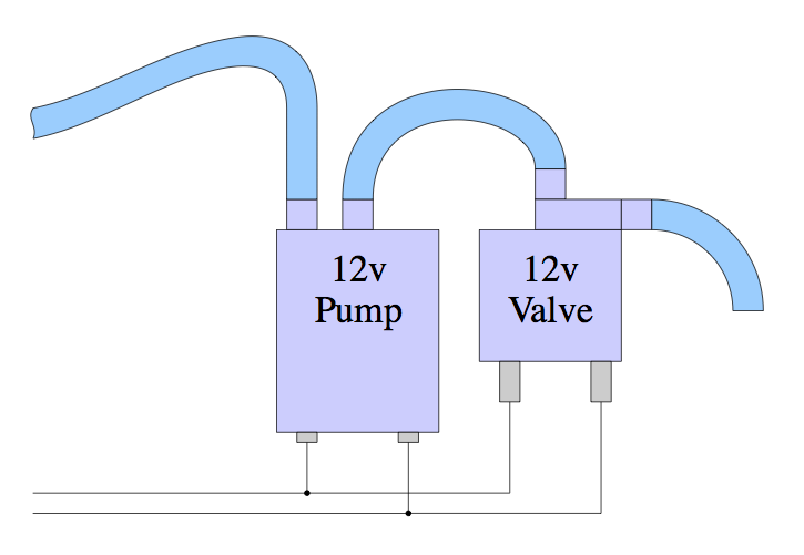
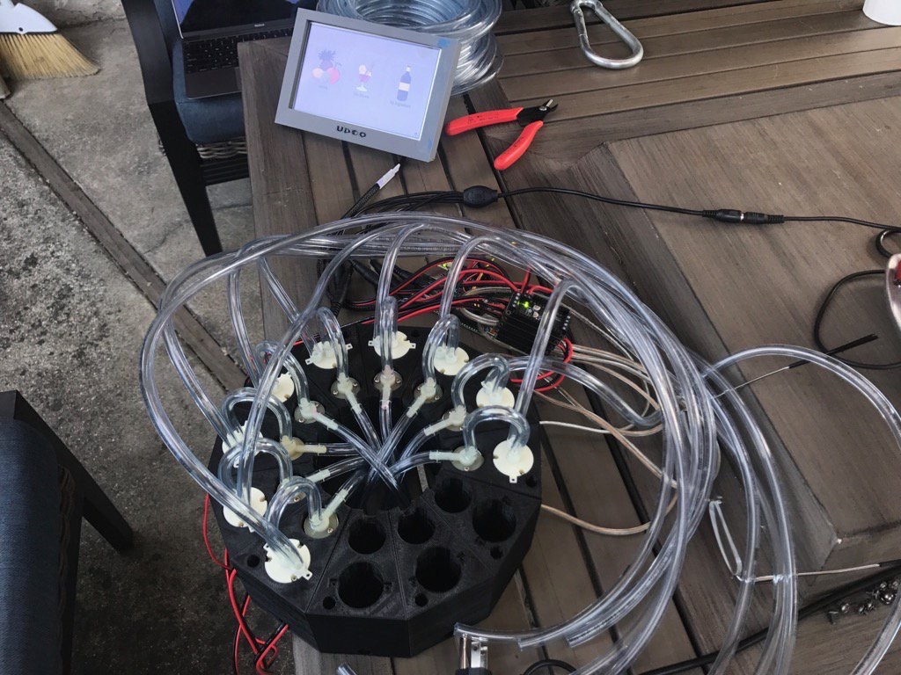

TikiBot
=======
Touchscreen BarBot software for auto-dispensing mixed drinks.  Runs under
Linux on a Raspberry Pi or Udoo, using DC motor controllers over I2C, to
activate pumps and valves to dispense ingredients.

TikiBot Lives!  It was a great success at my friend's Tiki themed party.

Standard Drinks List
--------------------
The default configuration is for a 12-feed TikiBot.
It expects the following ingredient feeds:

1. Meyer's Dark Rum
2. Appleton's Signature Blend
3. Meyer's Platinum White Rum
4. Lemonheart 151 Rum
5. Lime Juice
6. Lemon Juice
7. Orange Juice
8. Pineapple Juice
9. Passion Fruit Syrup
10. Sugar Syrup
11. Angostura Bitters
12. Grenadine

The following Tiki recipes can be made from those:

1. Beachcomber's Gold
2. Chief Lapu Lapu
3. Hurricane
4. Planter's Punch
5. Shrunken Skull
6. Tiger Shark
7. Trader Vic Grog
8. Zombie

The following non-alcoholic juice drinks can also be made:

1. Orange Juice
2. Pineapple Juice
3. Pineapple Orange Juice
4. Tropical Punch

Hardware
--------
This software has been tested with the following hardware:

- Udoo Neo ( [Udoo.org](https://www.udoo.org) )
- 7" 800x480 Touchscreen HDMI display
- 3 Adafruit DC Motor Featherwings ( [Adafruit.com](https://www.adafruit.com/product/2927) )
- 12 Small self-priming pumps ( [TrossenRobotics.com](http://www.trossenrobotics.com/robotgeek-pump-small) )
- 12 Normally Closed solonoid valves ( [Amazon.com](https://www.amazon.com/dp/B007D1U64E/ref=cm_sw_r_tw_dp_x_qDVWzbPCEW4K5) )

Each DC Motor controller handles up to 4 feeds.  Each motor controller will
need to have a consecutive different I2C address. You can alternately use
the following DC motor controllers without changing any code:

- Adafruit DC & Stepper Motor HAT for Raspberry Pi ( [Adafruit.com](https://www.adafruit.com/product/2348) )
- Adafruit Motor/Stepper/Servo Shield for Arduino v2 ( [Adafruit.com](https://www.adafruit.com/product/1438) )

It should be trivial to use a Raspberry Pi instead of the Udoo Neo.
Probably the easiest configuration would be to use a Raspberry Pi
with a few stacked DC Motor HATs.

Each feed is a paired pump and valve, wired in parallel.
Each pump/valve combo should be wired and plumbed as follows:

The polarity of the wiring is irrelevant for the linked pumps and
valves.  For them, either polarity will result in the forward pump
action with the valve open.

The pumps-valve pairs can be seated into a ring of Pump Wedges that can
be 3D printed from the model `STLs/PumpWedge12.stl` (for a 12 feed ring)
or `STLs/PumpWedge16.stl` (for 16 feed rings).  A corresponding Feed Guide
model can be found as `STLs/FeedGuide12.stl` or `STLs/FeedGuide16.stl`.
The feed guide has a slot in the bottom that can hold a funnel for all
the feeds to pour and mix into, which will drain into the target glass
or cup.

Installation
------------

    unzip TikiBot.zip
    cd TikiBot
    pip3 install -r requirements.txt

Running TikiBot
---------------
`gui.py` is the main file to run to launch this application.  You will
need to run it using Python 3.6 or better.

     cd TikiBot/TikiBot
     python3 gui.py

Configuration
-------------
The file `TikiBot/resources/tikibot_configs.yaml`: Contains all configs
for passcode, feeds, recipes, etc. for a standard set of Tiki drinks.
On first run, if you edit any configs on the configuration screen,
these configs will be written out to the file `$HOME/.tikibot.yaml`,
which will be read in all future runs.

In the lower right corner of the main screen is a gear icon.  This is
the configuration menu button. If you press it, it will ask for an
administrative passcode.  The default is '8888'.  Once you enter the
correct passcode, you will be shown the configuration screen.  From
here, you can change the passcode (recommended!), add, edit and re-order
feeds, add, and edit drink recipes, and shutdown or reboot the system.
Any changes made here will be saved to the `$HOME/.tikibot.yaml` file.

Calibration
-----------

1. Enter the configuration screen as described above.

2. In the configuration screen, the `Manage Feeds` button will show you
    all of the feeds that the software expects, in the order that it
    expects them.

3. Take an empty cup and zero a gram scale with it on it.  Make sure the
    scale is set to measure grams.

4. Select a feed, and you will be presented with a screen that will let
    you rename it, enable/disable it, start and stop it manually, and
    calibrate it.

5. Make sure that the feed line you selected has the expected ingredient
    attached.

6. Place the cup under the output of the feed.

7. Press the `Start Feed` button to prime the feedline.

8. When fluid starts pouring into the cup, press the `Stop Feed` button.

9. Pressing the calibration button will show you a screen which will let
    you calibrate the flow rate and pulse overage for that feed.

10. Start with a Pulse overage of 0.2 and a Duty cycle of 100%.  Those
    are only really needed for advanced calibration.  Select an amount
    of 25 milliliters to dispense.  A flow rate of 12.0 is a reasonable
    starting place.

11. Empty the cup and re-zero the scale with the empty cup.

12. Place the cup back under the output of the feed.

13. Press `Pour` to dispense into the cup.  Wait for it to finish dispensing.

14. Weigh the cup, to see how many grams of fluid were dispensed.

15. Take the number of grams measured, divide it by the expected number of
    milliliters dispensed (25mL, if you followed the above instructions),
    then multiply that by the current `Flow` setting.  Change the `Flow`
    to this new value.

    `newflow = oldflow * dispensed / expected`

    Note: You can expect viscous fluids like Sugar Syrup to have very low
    flow rates like 2.5 mL/s.

16. Repeat steps 11 to 15 a couple times until the amount dispensed is
    within about a gram of the expected amount.

17. Press the back arrow button to get back to the feeds listing screen.

18. Select the next feed button and go back to step 3.  Repeat until all
    feeds have been calibrated.

